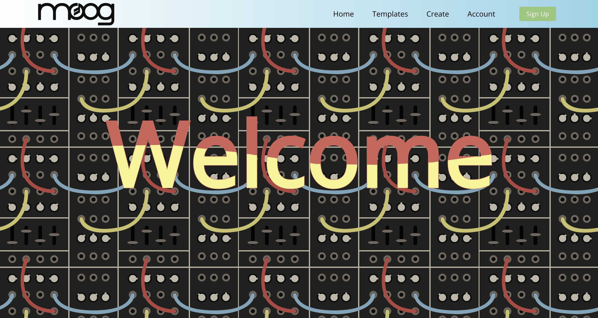
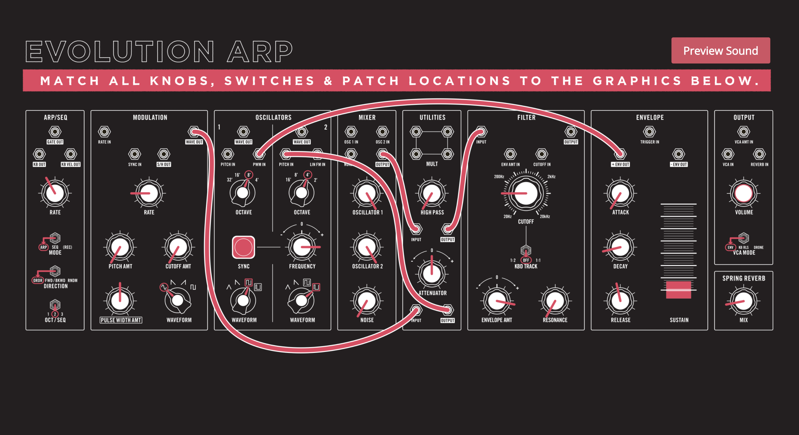
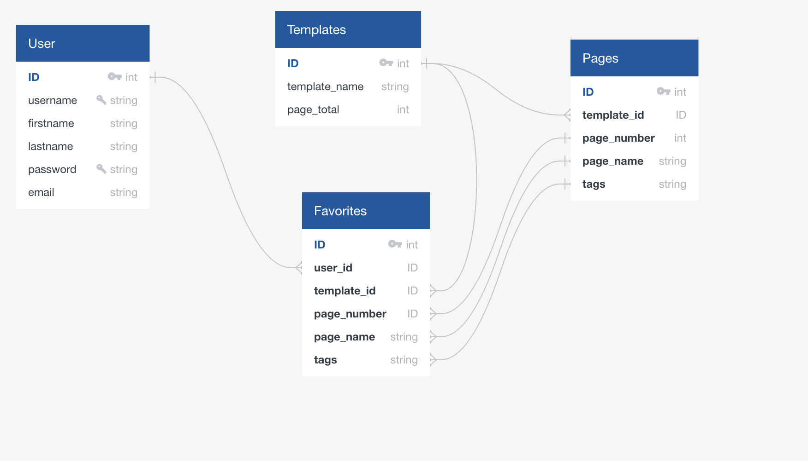

# Moog Patchbook Application
* The main objective of this app is to provide audio previews for Analog Synth patches, currently for the Semi-Modular Moog Grandmother. 

## Live link
* [Heroku](https://moog-pern-app.herokuapp.com/home)

## Framework
* This project was bootstrapped with [Create React App](https://github.com/facebook/create-react-app).
* In addition to Node, Express, JS, PosgreSQL, React Router and a custom Restful API.

## Demo
* No need to signup, you can login with the following credentials:

* username | password     | email  

* testme   | test         | testme@test.com

## Homepage

## Patch Preview

## Database Schema

## User Flow

* A User can Signup/Login/Edit and Delete with a Username, Email (No Contact), and Password. Password is cryptographically hashed with bcrypt and Users are generated a jwt for authenticaion through user routes.

* A User can view templates and preview audio of each patch to hear results.

* A User can click external links to visit Moog's website for product and MetaPatch to create patches of their own.

* The Moog logo links to Moog's website and Create links to MetaPatch for creating your own synth patches using responsive templates.

In the project directory, you can run:

### `npm i` from root folder for server dependencies
### `npm i` from client folder for client dependcies

### `npm start` from client folder to run front-end
### `npx nodemon index.js` from root folder to run back-end

Runs the app in the development mode.\
Open [http://localhost:3000](http://localhost:3000) to view it in your browser.
